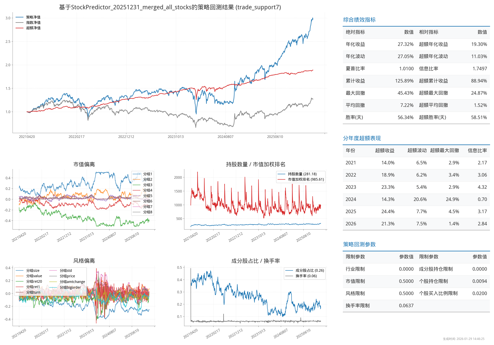

# 📈 Backtester 项目

本项目是一个基于 Python 的量化投资策略回测框架，旨在对多因子策略进行历史回测、组合优化、持仓管理和可视化分析。框架支持股票日度数据回测，并集成了交易约束、持仓优化、策略绩效评估、参数优化和风险管理等全流程功能。

---

## 功能特性 ✨

### 核心回测功能

1. **账户与交易管理 💰**
   - `src/account.py` 提供账户和股票持仓管理类，实现买入、卖出、每日刷新及交易日志记录。
   - 支持交易费、最小交易量、单位交易量等约束。
   - 支持 5、7、BARRA 交易约束规则。

2. **数据加载与处理 📊**
   - 负责从 feather 文件和 CSV 文件加载日度行情、前复权因子、涨跌停价及指数数据。
   - 支持每日可交易股票筛选及复权处理。
   - 集成多种数据源支持，包括风格因子、行业分类、指数成分等。

3. **组合优化引擎 🧮**
   - `src/portfolio_optimizer.py` 使用 CVXPY 求解组合优化问题。
   - 支持多种约束: 持仓上下限、行业/风格暴露、最大换手率、指数成分偏离等。
   - 提供多种优化策略: solve（优化求解）和 topn（ Top N 选择）。

4. **回测引擎 ⚡**
   - `src/backtest.py` 提供完整回测流程: 
     - 开盘前刷新账户信息
     - 基于组合优化生成每日目标持仓
     - 执行买卖操作并更新账户
     - 记录每日账户净值、现金、持仓和交易明细

   - `src/backtest_continuous.py` 和 `src/backtest_continuous_general.py` 提供连续回测功能
   - `src/backtest_apm.py` 提供 APM 回测功能
   - 支持多策略组合和指数比较。

5. **策略分析与绩效评估 📈**
   - `src/analysis.py` 提供全面的绩效指标计算: 
     - 基础指标: 年化收益、波动、夏普比率、最大回撤、Calmar 比率
     - 超额指标: 超额年化收益、信息比率、超额最大回撤
     - 交易指标: 最大连续亏损天数、胜率(天)、换手率等

6. **可视化与报告 🎨**
   - `src/plot.py` 支持 Matplotlib PNG 绘图。
   - 可展示策略净值、超额收益、持仓分析及关键回测指标。
   - 自动生成专业的回测报告。

7. **工具函数库 🔧**
   - `src/utils.py` 提供每日行情和数据缓存、加载工具，提升回测效率。
   - `src/fusion.py` 支持多策略信号融合。
   - `src/compare.py` 提供策略比较功能。
   - `src/update_vwap_twap.py` 提供 VWAP/TWAP 更新功能。

### 高级功能模块

8. **参数优化系统 🎯**
   - **高斯过程优化**: 基于 GP 的贝叶斯参数优化
   - **有效前沿分析**: 数学优化方法构建有效前沿
   - 支持多目标优化: 收益最大化、风险最小化、夏普比率优化
   - 自动参数寻优和性能评估

9. **Barra 风险模型 📊**
   - `barra/` 模块提供完整的风险因子分析功能
   - 支持风格因子、行业因子风险暴露分析
   - 风险归因和因子收益分解

10. **ETF 分析模块 📱**
    - `etf/` 模块提供 ETF 投资组合分析功能
    - 支持 ETF 组合净值计算和分析
    - 提供 ETF 投资策略回测

11. **多策略支持 🔄**
    - 支持单策略和多策略组合回测
    - 策略信号融合和权重分配
    - 策略间相关性分析

12. **自动化脚本 🚀**
    - `scripts/` 目录提供多种自动化运行脚本
    - 支持批量回测、参数优化、结果分析
    - Screen 后台运行和日志管理

---

## 安装依赖 🛠

### 核心依赖

```bash
# 建议使用 Python 3.12
pip install pandas numpy matplotlib plotly cvxpy tqdm

# 参数优化额外依赖
pip install scikit-learn scipy

# 可选: Jupyter 支持
pip install jupyter notebook
```

### 环境配置

```bash
# 创建虚拟环境
python -m venv backtester_env
source backtester_env/bin/activate  # Linux/Mac
# 或 backtester_env\Scripts\activate  # Windows

# 安装依赖
pip install -r requirements.txt  # 如果有 requirements.txt
```

---

## 项目结构 💼

```
backtester/
├── run.py                           # 主回测入口
├── run_gp.py                        # GP优化入口
├── README.md                         # 项目说明文档
├── CHANGELOG                         # 版本更新日志
├── CONTRIBUTING.md                   # 贡献指南
├── LICENSE                          # 开源协议
├── .gitignore                        # Git忽略文件
│
├── src/                              # 核心回测模块
│   ├── account.py                   # 账户和股票管理 💰
│   ├── analysis.py                  # 回测结果分析 📈
│   ├── backtest.py                  # 回测主逻辑 ⚡
│   ├── backtest_apm.py              # APM回测逻辑
│   ├── backtest_continuous.py       # 连续回测逻辑
│   ├── backtest_continuous_general.py # 通用连续回测
│   ├── config.py                    # 配置参数 ⚙️
│   ├── fusion.py                    # 多策略信号融合
│   ├── compare.py                   # 策略比较
│   ├── optimizer.py                 # 优化器
│   ├── param_manager.py             # 参数管理器
│   ├── plot.py                      # 回测可视化 🎨
│   ├── portfolio_optimizer.py       # 组合优化 🧮
│   ├── scores_analysis_gzh.py       # 评分分析工具
│   ├── strategy.py                  # 策略基类
│   ├── update_trade_support5.py     # 5约束更新
│   ├── update_trade_support7.py     # 7约束更新
│   ├── update_vwap_twap.py          # VWAP/TWAP更新
│   └── utils.py                     # 工具函数 🔧
│
├── scripts/                          # 自动化脚本
│   ├── run.sh                       # 基础回测脚本
│   ├── run_copy.sh                  # 复制回测脚本
│   ├── run_daily_update.sh          # 每日更新脚本
│   ├── run_daily_update_10.sh       # 每日更新脚本(10)
│   ├── run_daily_update_compare.sh  # 每日更新比较脚本
│   ├── run_daily_update_fusion_10.sh # 每日更新融合脚本(10)
│   ├── run_daily_update_noon.sh     # 午盘更新脚本
│   ├── run_daily_update_noon_10.sh  # 午盘更新脚本(10)
│   ├── run_mix_morining_label.sh    # 混合早盘标签脚本
│   ├── run_mix_morining_noon.sh     # 混合早盘午盘脚本
│   ├── run_mix_noon_label.sh        # 混合午盘标签脚本
│   ├── run_para_ef.sh               # 有效前沿优化脚本
│   ├── run_para_optimizer_gp5.sh    # GP优化脚本(5约束)
│   ├── run_para_optimizer_gp7.sh    # GP优化脚本(7约束)
│   └── run_score_analysis.sh        # 评分分析脚本
│
├── para_optimizer_ef/               # 有效前沿参数优化
│   ├── run.py                       # 有效前沿运行入口
│   ├── README.md                    # 有效前沿说明
│   ├── src/                         # 优化源码
│   │   ├── run_ratio_score_trade_support5.ipynb
│   │   ├── run_ratio_score_trade_support7.ipynb
│   │   ├── run_std_ratio_score_trade_support5.ipynb
│   │   ├── run_std_ratio_score_trade_support7.ipynb
│   │   ├── run_std_score_trade_support5.ipynb
│   │   └── run_std_score_trade_support7.ipynb
│   ├── parameters/                  # 优化参数存储
│   └── scores/                      # 优化结果存储
│
├── barra/                           # Barra风险模型
│   ├── data.py                      # 数据处理
│   ├── factor_name_mapping.py       # 因子名称映射
│   ├── test.ipynb                   # 测试笔记本
│   └── barra/                       # Barra核心模块
│       ├── src/                     # Barra源码
│       │   ├── config.py
│       │   ├── data.py
│       │   ├── main.py
│       │   ├── prepare_fin_data.py
│       │   └── utils.py
│       └── tests/                   # Barra测试
│           ├── check_barra_with_tonglian.py
│           ├── check_fin_data.py
│           ├── check_null.py
│           ├── factor_name_mapping.py
│           ├── plot_barra_correlation.py
│           ├── run_one_month_factors.py
│           ├── test_factor_calculation.py
│           ├── test_main.py
│           ├── test_mysql.py
│           └── test.ipynb
│
├── etf/                             # ETF分析模块
│   ├── data.ipynb                   # ETF数据分析
│   ├── etf_portfolio_nav_with_capital.py # ETF组合净值计算
│   ├── find_index.py                # 指数查找
│   ├── temp.py                      # 临时脚本
│   └── output/                      # ETF输出结果
│
├── docs/                            # 详细文档
│   ├── account.md                   # 账户管理文档
│   ├── backtest.md                  # 回测引擎文档
│   ├── bayesian_optimization_theory.md  # 贝叶斯优化理论
│   ├── financial_metrics.md         # 金融指标说明
│   ├── para_optimizer_gp.md         # GP参数优化文档
│   └── portfolio_optimizer.md       # 组合优化文档
│
├── image/                           # 图片资源
│   └── chart.png                    # 回测结果图
│
├── results/                         # 回测结果目录（运行时生成）
│   └── backtests/                   # 回测报告存储
└── data/                           # 数据目录（需自行配置）
```

## 使用说明 📝

### 1. 环境准备 ⚙️

#### 数据路径配置

修改 `src/config.py` 中的关键路径: 

```python
# 数据路径配置
DATA_PATH = r"/home/haris/project/backtester/data"                    # 项目数据目录
DAILY_DATA_PATH = r"/home/haris/data/data_frames"                      # 日度数据目录
TEST_RESULT_PATH = r"/home/haris/project/backtester/results"           # 结果输出目录
SUPPORT5_PATH = r"/home/haris/data/trade_support_data/trade_support5"  # 5约束数据
SUPPORT7_PATH = r"/home/haris/data/trade_support_data/trade_support7"  # 7约束数据

# 策略评分文件
SCORES_PATH = r"/home/haris/results/predictions/StockPredictor_20251119_043804_combined_predictions.csv"
```

#### 核心参数设置

```python
# 基本参数
INITIAL_MONEY = 10010000.0    # 初始资金（约1000万）
TOT_HOLD_NUM = 200           # 总持仓数量
DAILY_SELL_NUM = 20          # 每日卖出数量
TRADE_SUPPORT = 5            # 交易约束类型（5或7）
STRATEGY_NAME = "StockPredictor"  # 策略名称

# 约束参数
CITIC_LIMIT = 0.06           # 行业偏离限制
CMVG_LIMIT = 0.2             # 市值偏离限制
STK_HOLD_LIMIT = 0.0106      # 个股持仓限制
OTHER_LIMIT = 1.08           # 风格因子偏离限制
STK_BUY_R = 0.0072           # 个股买入比例
TURN_MAX = 0.09              # 最大换手率
MEM_HOLD = 0.2               # 成分股持仓比例
```

### 2. 数据准备 📂

#### 必需数据文件

- **日度行情数据**（feather格式）: 
  - `stk_close` - 收盘价
  - `stk_preclose` - 前收盘价
  - `stk_adjfactor` - 复权因子
  - `stk_ztprice` - 涨停价
  - `stk_dtprice` - 跌停价

- **指数数据**: 
  - `idx_close` - 指数收盘价

- **策略评分文件**: 
  - `predictions/SCORES_PATH.csv` - 包含股票预测评分

- **支持数据**: 
  - 风格因子数据
  - 行业分类数据
  - 指数成分股数据
  - 交易约束数据（5/7）

### 3. 基础回测运行 ▶️

#### 单策略回测

```bash
# 基础回测
python run.py --scores_path "/path/to/scores.csv" --trade_support 5
python run.py --scores_path "/path/to/scores.csv" --trade_support 7

# TopN 策略（非优化）
python run.py --scores_path "/path/to/scores.csv" --trade_support 7 --strategy topn
```

#### 批量回测

```bash
# 使用脚本批量运行
screen -dmS backtester bash -c 'bash scripts/run.sh > logs/backtest.log 2>&1'
screen -dmS backtester bash -c 'bash scripts/run_daily_update.sh > logs/daily_update.log 2>&1'
screen -dmS backtester bash -c 'bash scripts/run_daily_update_noon.sh > logs/daily_update_noon.log 2>&1'
```

#### 多策略组合回测

```bash
# 多策略信号融合
python run.py --scores_path "/path/to/scores1.csv,/path/to/scores2.csv" --trade_support 7
```

#### 命令行参数说明

```bash
--scores_path      # 策略评分文件路径（支持逗号分隔的多文件）
--trade_support    # 交易约束类型（5或7）
--strategy         # 策略类型（solve/topn，默认solve）
--tot_hold_num     # 总持仓数量（默认200）
--daily_sell_num   # 每日卖出数量（默认20）
--citic_limit      # 行业偏离限制
--cmvg_limit       # 市值偏离限制
--stk_hold_limit   # 个股持仓限制
--other_limit      # 风格因子偏离限制
--stk_buy_r        # 个股买入比例
--turn_max         # 最大换手率
--mem_hold         # 成分股持仓比例
--plot             # 是否生成图表（默认True）
--afternoon_start  # 是否下午开始交易（默认False）
--start_date_shift # 开始日期偏移天数（默认0）
```

### 4. 高级功能使用 🚀

#### 参数优化

```bash
# 高斯过程参数优化
python run_gp.py --scores_path "/path/to/scores.csv" --trade_support 5

# 有效前沿参数优化
screen -dmS ef_opt bash -c 'bash scripts/run_para_ef.sh > logs/backtest_para_ef.log'
```

#### ETF 分析

```bash
# 运行 ETF 组合分析
cd etf
python etf_portfolio_nav_with_capital.py
```

#### Barra 风险分析

```bash
# 运行 Barra 风险模型
cd barra
python barra/src/main.py
```

### 5. 结果查看与分析 📊

#### 回测结果结构

```python
result = run_backtest()
print(result.keys())
# dict_keys(['info', 'tot_account_s', 'hold_style', 'trades', 'positions'])
```

#### 关键输出文件

- **PNG 报告**: `results/backtests/{STRATEGY_NAME}.png`
- **持仓明细**: `results/backtests/{STRATEGY_NAME}_positions.csv`
- **交易记录**: `results/backtests/{STRATEGY_NAME}_trades.csv`

#### ETF 分析输出

- **ETF 组合结果**: `etf/output/portfolio_nav_results_*.csv`
- **ETF 净值曲线**: `etf/output/portfolio_nav_curve_*.png`
- **ETF 分析日志**: `etf/output/etf_analysis_*.log`

#### 可视化报告示例

- 

---

## 快速示例 💡

### 基础回测示例

```python
from src.backtest import run_backtest

# 运行基础回测
result = run_backtest()

# 查看回测总览
print(result["info"])

# 查看关键指标
print(f"年化收益: {result['info']['年化收益']:.2%}")
print(f"夏普比率: {result['info']['夏普比率']:.2f}")
print(f"最大回撤: {result['info']['最大回撤']:.2%}")
```

### 高级配置示例

```python
import argparse
from src import config
from src.backtest import run_backtest

# 自定义参数
args = argparse.Namespace()
args.scores_path = "/path/to/custom_scores.csv"
args.trade_support = 7
args.strategy = "solve"
args.tot_hold_num = 150
args.turn_max = 0.12

# 更新配置并运行
config.update_from_args(args)
result = run_backtest()
```

### ETF 分析示例

```python
# ETF 组合分析
from etf.etf_portfolio_nav_with_capital import analyze_etf_portfolio

# 运行 ETF 分析
analyze_etf_portfolio()
```

### 输出文件路径

- **PNG 报告**: `results/backtests/{STRATEGY_NAME}.png`
- **持仓明细**: `results/backtests/{STRATEGY_NAME}_positions.csv`
- **交易记录**: `results/backtests/{STRATEGY_NAME}_trades.csv`
- **ETF 分析结果**: `etf/output/` 目录

---

## 高级功能详解 🎯

### 参数优化系统

#### 高斯过程优化（GP）

```python
# 运行 GP 参数优化
python run_gp.py --scores_path "/path/to/scores.csv" --trade_support 5
```

**特点: **

- 基于贝叶斯优化的智能参数搜索
- 自动平衡探索与利用
- 支持多目标优化
- 适用于复杂参数空间

#### 有效前沿分析

```python
# 运行有效前沿优化
cd para_optimizer_ef
python run.py
```

**特点: **

- 数学严格的有效前沿构建
- 支持多种风险收益目标
- 凸包算法和二次函数拟合
- 分散化参数筛选

### Barra 风险模型

```python
# 使用 Barra 风险模型
cd barra
python barra/src/main.py
```

**功能: **

- 风格因子暴露分析
- 行业因子风险控制
- 风险归因分析
- 因子收益分解

### ETF 分析模块

```python
# ETF 组合分析
from etf.etf_portfolio_nav_with_capital import analyze_etf_portfolio

# 运行分析
analyze_etf_portfolio()
```

**功能: **

- ETF 组合净值计算
- 不同权重策略比较
- 净值曲线可视化
- 绩效指标分析

### 多策略融合

```python
# 多策略信号融合示例
from src.fusion import fuse_strategies

# 融合多个策略信号
fused_scores = fuse_strategies([
    "strategy1_scores.csv",
    "strategy2_scores.csv",
    "strategy3_scores.csv"
], weights=[0.4, 0.3, 0.3])
```

---

## 详细文档索引 📚

### 核心模块文档

- [账户管理详解](docs/account.md) - 账户、持仓、交易机制
- [回测引擎详解](docs/backtest.md) - 回测流程、事件驱动机制
- [策略分析详解](docs/analysis.md) - 绩效指标计算、分析方法
- [组合优化详解](docs/portfolio_optimizer.md) - 优化模型、约束设置
- [金融指标说明](docs/financial_metrics.md) - 各项指标计算方法

### 优化算法文档

- [贝叶斯优化理论](docs/bayesian_optimization_theory.md) - GP 优化理论基础
- [GP 参数优化详解](docs/para_optimizer_gp.md) - 高斯过程优化实战
- [有效前沿理论](para_optimizer_ef/README.md) - 数学优化方法详解

### 开发指南

- [贡献指南](CONTRIBUTING.md) - 代码规范、提交流程
- [版本更新日志](CHANGELOG) - 历史版本更新记录

---

## 常见问题解答 ❓

### Q1: 如何处理缺失数据？

```python
# 在 config.py 中设置缺失数据处理方式
HANDLE_MISSING = "forward_fill"  # 或 "drop", "interpolate"
```

### Q2: 如何添加自定义约束？

```python
# 在 portfolio_optimizer.py 中添加自定义约束
def add_custom_constraints(prob, weights, data):
    prob += cp.sum(weights[custom_stocks]) <= 0.05  # 自定义约束
    return prob
```

### Q3: 如何使用 ETF 分析模块？

```python
# 运行 ETF 分析
cd etf
python etf_portfolio_nav_with_capital.py
```

---

## 开发与扩展 🔧

### 自定义策略开发

```python
from src.strategy import BaseStrategy

class CustomStrategy(BaseStrategy):
    def generate_signals(self, data):
        # 实现自定义信号生成逻辑
        return signals

    def optimize_portfolio(self, signals, constraints):
        # 实现自定义组合优化
        return weights
```

### 扩展数据源

```python
# 扩展数据源加载
from src.utils import load_custom_data

def load_my_data(path):
    # 加载自定义数据源
    return data
```

### 添加新的优化器

```python
from src.portfolio_optimizer import BaseOptimizer

class CustomOptimizer(BaseOptimizer):
    def optimize(self, expected_returns, covariance, constraints):
        # 实现自定义优化算法
        return weights
```

### 扩展方向

- **机器学习集成**: 集成深度学习模型进行信号预测
- **实时交易支持**: 扩展为实盘交易系统
- **多资产类别**: 支持债券、期货、期权等多资产
- **风险管理增强**: 添加更多风险控制和压力测试功能
- **高频策略支持**: 支持分钟级、秒级高频策略回测
- **ETF 策略扩展**: 开发更多 ETF 投资策略

---

## 社区与支持 🤝

- **问题反馈**: 通过 [Issues](https://github.com/your-repo/issues) 提交问题
- **功能建议**: 欢迎提出新功能想法和改进建议
- **代码贡献**: 欢迎提交 Pull Request 参与项目开发
- **技术交流**: 加入技术讨论群进行交流

---

## 许可证 📄

本项目采用 [MIT License](LICENSE) 开源协议，详情请查看许可证文件。
