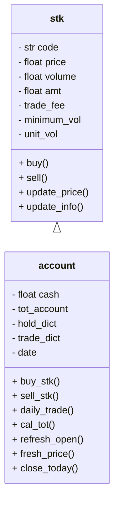
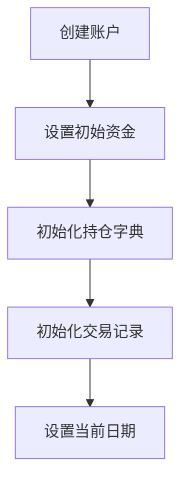
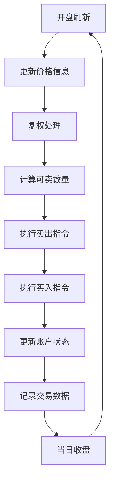

# 账户 (Account) 详细说明

## 概述

`account.py` 模块实现了一个完整的证券交易账户管理系统，包含股票对象 (`stk`) 和账户对象 (`account`) 两个核心类。该系统模拟了真实的证券交易环境，支持买卖操作、持仓管理、资金计算、交易记录等功能，是量化交易回测系统的基础组件。

## 系统架构



## 详细说明

### 1. stk 类 - 股票对象

#### 属性说明

| 属性           | 类型  | 说明         |
| -------------- | ----- | ------------ |
| `code`         | str   | 股票代码     |
| `price`        | float | 当前价格     |
| `up_price`     | float | 涨停价       |
| `low_price`    | float | 跌停价       |
| `volume`       | float | 持仓数量     |
| `amt`          | float | 持仓金额     |
| `sellable_vol` | float | 可卖数量     |
| `trade_fee`    | float | 交易手续费率 |
| `minimum_vol`  | int   | 最小交易单位 |
| `unit_vol`     | int   | 交易单位倍数 |

#### 交易规则

根据中国 A 股市场规则：

- **科创板**（代码前缀 "68"）：

  - 最小交易单位：200 股
  - 交易单位倍数：1 股

- **其他板块**（主板、中小板、创业板）：
  - 最小交易单位：100 股
  - 交易单位倍数：100 股

#### 核心方法

##### 买入操作

```python
def buy(self, vol):
    amt = vol * self.price
    self.volume += vol
    self.amt = self.volume * self.price
    return amt
```

买入金额计算公式：
$$\mathrm{Amt_{buy} = Volume_{buy} \times Price_{current}}$$

##### 卖出操作

```python
def sell(self, vol):
    amt = vol * self.price * (1 - self.trade_fee)
    self.volume -= vol
    self.sellable_vol -= vol
    self.amt = self.volume * self.price
    return amt
```

卖出金额计算公式：
$$\mathrm{Amt_{sell} = Volume_{sell} \times Price_{current} \times (1 - fee_{rate})}$$

### 2. account 类 - 账户对象

#### 属性说明

| 属性           | 类型      | 说明                      |
| -------------- | --------- | ------------------------- |
| `cash`         | float     | 可用现金                  |
| `tot_account`  | float     | 账户总资产                |
| `hold_dict`    | dict      | 持仓字典 {code: stk 对象} |
| `trade_dict`   | dict      | 交易记录字典              |
| `date`         | datetime  | 当前交易日期              |
| `td_upper`     | pd.Series | 当日涨停价序列            |
| `td_lower`     | pd.Series | 当日跌停价序列            |
| `td_price_now` | dict      | 当前价格字典              |

#### 核心方法

##### 总资产计算

```python
def cal_tot(self):
    tot = sum(stk.amt for stk in self.hold_dict.values())
    self.tot_account = tot + self.cash
    return self.tot_account
```

总资产计算公式：
$$\mathrm{Total\_Asset = Cash} + \sum_{i=1}^{n} (\mathrm{Volume}_i \times \mathrm{Price}_i)$$

##### 开盘刷新

```python
def refresh_open(self, td_upper, td_lower, td_preclose, td_adj):
    # 更新价格信息
    for code, st in self.hold_dict.items():
        st.update_info(td_preclose[code], td_upper[code], td_lower[code])
        # 复权处理
        if code in td_adj:
            st.volume *= td_adj[code]
            st.amt = st.volume * st.price
        st.sellable_vol = st.volume
```

复权后的持仓数量：
$$\mathrm{Volume_{adj} = Volume_{original} \times Adj\_Factor}$$

##### 日内交易

```python
def daily_trade(self, cash_avail, to_buy_s, to_sell_s):
    tot_buy = tot_sell = 0

    # 先卖出
    for code in to_sell_s.index:
        if code not in self.hold_dict:
            continue
        st = self.hold_dict[code]
        if st.low_price < st.price < st.up_price:  # 价格在涨跌停范围内
            vol = min(to_sell_s[code], st.sellable_vol // st.unit_vol * st.unit_vol)
            if vol >= st.minimum_vol:
                tot_sell += self.sell_stk(code, vol)

    # 后买入
    for code in to_buy_s.index:
        if tot_buy >= cash_avail + tot_sell - 1000:  # 保留现金缓冲
            break
        # ... 买入逻辑
```

##### 交易记录

```python
def log_trade(self, code, price, vol):
    self.trade_dict.setdefault(code, []).append([vol, price, self.date])
```

交易记录格式：`[成交量, 成交价格, 交易日期]`

## 流程框图

### 1. 账户初始化



### 2. 交易日流程



### 3. 交易执行逻辑

#### 卖出优先原则

1. **流动性优先**：先卖出释放资金
2. **价格约束**：只在涨跌停范围内交易
3. **数量约束**：满足最小交易单位和可卖数量

#### 买入资金管理

实际可买资金计算：
$$\mathrm{Cash_{available} = Cash_{sell\_proceeds} + Cash_{original} - Buffer}$$

其中 $\mathrm{Buffer}$ 通常设为 $1000$ 作为现金缓冲。

## 数据结构

### 1. 持仓数据结构

```python
hold_dict = {
    "000001": stk_object,  # 股票代码: stk对象
    "000002": stk_object,
    # ...
}
```

### 2. 交易记录数据结构

```python
trade_dict = {
    "000001": [            # 股票代码
        [100, 10.5, "2024-01-01"],  # [成交量, 成交价, 日期]
        [200, 10.8, "2024-01-02"],
        # ...
    ],
    # ...
}
```

### 3. 输出数据格式

#### 持仓 DataFrame

```
        volume    amt
000001   1000   10500
000002    500    8000
```

#### 交易 DataFrame

```
     code  volume  price        date
0  000001     100   10.5  2024-01-01
1  000001    -100   10.8  2024-01-02
2  000002     200   16.0  2024-01-01
```
