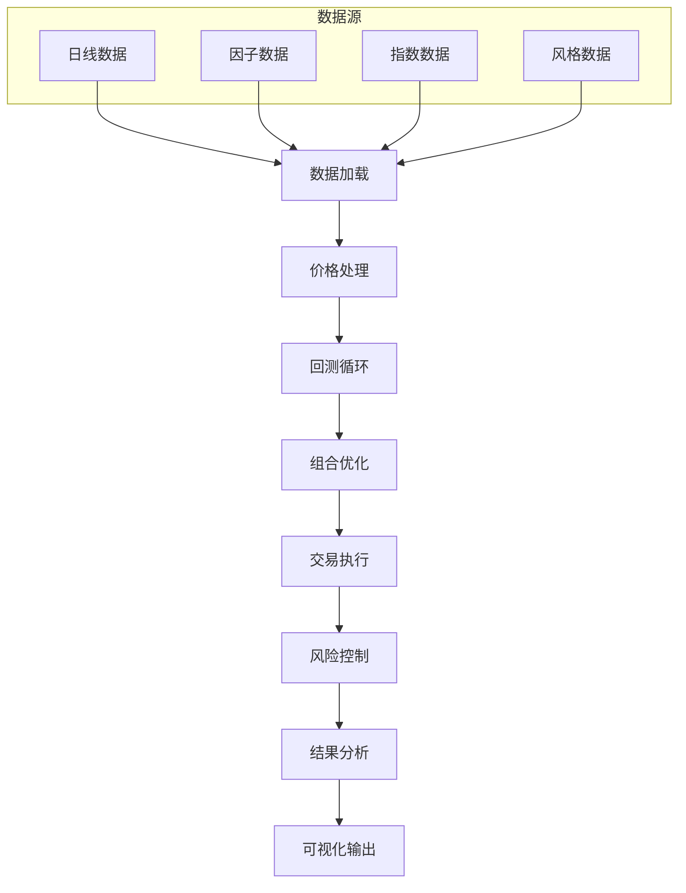
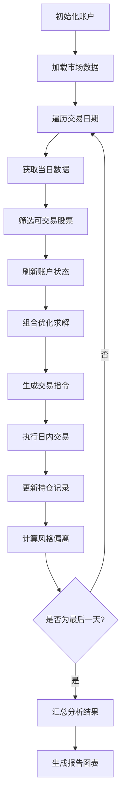

# 回测 (Backtest) 详细说明

## 概述

`backtest.py` 是量化交易系统的核心回测引擎，实现了完整的基于投资组合优化的量化策略回测框架。该模块集成了数据加载、价格处理、组合优化、交易执行、风险控制和结果分析等完整功能，支持多因子选股、风格控制、行业配置等高级量化策略。

## 系统架构



## 核心功能模块

### 1. 数据加载与预处理

#### `load_daily_data()` 函数

```python
def load_daily_data(name):
    return pd.read_feather(os.path.join(config.DAILY_DATA_PATH, f"{name}.feather"))
```

支持的数据类型：

| 数据类型 | 文件名 | 说明 |
|---------|--------|------|
| 涨停价 | `stk_ztprice` | 股票涨停价格 |
| 跌停价 | `stk_dtprice` | 股票跌停价格 |
| 前收盘 | `stk_preclose` | 前一交易日收盘价 |
| 复权因子 | `stk_adjfactor` | 价格复权调整因子 |
| 收盘价 | `stk_close` | 当日收盘价 |
| 指数收盘 | `idx_close` | 指数收盘价 |

#### 数据预处理逻辑

```python
high_limit = load_daily_data("stk_ztprice").replace(0, np.nan).ffill()
low_limit = load_daily_data("stk_dtprice").replace(0, np.nan).ffill()
pre_close = load_daily_data("stk_preclose").replace(0, np.nan).ffill()
adj_factor = load_daily_data("stk_adjfactor").replace(0, np.nan).ffill()
close = load_daily_data("stk_close").replace(0, np.nan).ffill()
```

**预处理步骤：**
1. **零值替换**：将价格数据中的 0 替换为 NaN
2. **前向填充**：使用 `ffill()` 进行前向填充，确保数据连续性

#### 价格计算

```python
# 连续涨停标识
last_zt_df = (close == high_limit).shift(1).fillna(False).astype(int)

# 价格区间计算
upper_price = pre_close + 0.9 * (high_limit - pre_close)
lower_price = pre_close + 0.9 * (low_limit - pre_close)

# 复权因子计算
adj = adj_factor / adj_factor.shift(1)
```

**价格区间公式：**
- 涨停价限制：$\mathrm{UpperPrice = PreClose + 0.9 \times (HighLimit - PreClose)}$
- 跌停价限制：$\mathrm{LowerPrice = PreClose + 0.9 \times (LowLimit - PreClose)}$

### 2. 主要回测函数：`run_backtest()`

#### 函数签名与参数说明

```python
def run_backtest():
    """
    运行完整的量化策略回测
    
    参数说明：
    ----------
    INITIAL_MONEY : float
        初始资金规模
    STK_HOLD_LIMIT : float
        单只股票持仓限制
    STK_BUY_R : float
        单只股票买入比例
    TURN_MAX : float
        最大换手率
    CITIC_LIMIT : float
        行业偏离限制
    CMVG_LIMIT : float
        市值风格偏离限制
    OTHER_LIMIT : float
        其他风格因子偏离限制
    
    返回值：
    -------
    dict
        包含回测结果的字典：
        - tot_account_s: 总资产序列
        - nv: 净值序列
        - info: 绩效分析结果
        - hold_style: 持仓风格数据
    """
```

#### 回测流程图



### 3. 核心回测逻辑

#### 3.1 数据准备阶段

```python
# 加载外部数据
vwap_df = pd.read_feather(os.path.join(config.DATA_PATH, "vwap.fea"))
scores = pd.read_csv(config.SCORES_PATH, index_col=0).T.sort_index().shift(1).dropna(how="all")

# 数据标准化处理
scores.columns = scores.columns.astype(str).str.zfill(6)
scores = scores[scores.columns[scores.columns.str[0].isin(["0", "3", "6"])]]
scores.index = scores.index.astype(str)
date_list = sorted(scores.index.tolist())
```

**股票筛选规则：**
- 代码格式：6位数字，补零对齐
- 板板过滤：保留主板（0）、创业板（3）、科创板（6）
- 数据完整性：剔除因子数据缺失的日期

#### 3.2 交易日循环处理

```python
for date in tqdm(date_list, desc="Backtesting"):
    # 获取当日市场数据
    td_open, td_close, td_preclose, td_adj, td_score, td_upper, td_lower, last_zt = get_daily_price(
        str(date), vwap_df, close, pre_close, adj, scores, upper_price, lower_price, last_zt_df
    )
    
    # 获取风格因子数据
    td_citic, td_cmvg, td_mem, zz_citic, zz_cmvg, style_fac, zz_style, sub_code_list = get_daily_support(str(date))
```

#### 3.3 可交易股票筛选

```python
# 基础筛选：价格数据完整性
code_list = pd.concat([td_upper, td_lower, td_close, td_open], axis=1).dropna(how="any").index.tolist()

# 进一步筛选
code_list = [x for x in code_list if (x in sub_code_list) & (x[0] != "4") & (x[0] != "8")]
```

#### 3.4 持仓限制计算

```python
# 个股持仓权限计算
stk_perm = (td_mem + td_mem.max()) * (config.STK_HOLD_LIMIT / (2 * td_mem.max()))

# 涨停股票处理
zt_codes = last_zt[last_zt == 1].index.tolist()
```

#### 3.5 账户状态刷新

```python
# 开盘前刷新参数
account0 = s.refresh_open(td_upper, td_lower, td_preclose.to_dict(), td_adj)
stk_buy_amt = pd.Series([config.STK_BUY_R * account0] * len(code_list), index=code_list)

# 涨停股票禁止买入
for code in zt_codes:
    if code in code_list:
        stk_buy_amt[code] = 0
```

#### 3.6 组合优化求解

```python
try:
    # 通过组合优化获取目标持仓
    tgt_hold = solve_problem(
        code_list,
        x_last=last_hold,
        score0=(td_score - td_score.min()) / (td_score.max() - td_score.min()),
        stk_low0=((td_mem - stk_perm).clip(0) * account0).clip(
            upper=last_hold + stk_buy_amt, lower=last_hold - 2 * config.STK_BUY_R * account0
        ),
        stk_high0=((td_mem + stk_perm) * account0).clip(
            upper=last_hold + stk_buy_amt, lower=last_hold - 2 * config.STK_BUY_R * account0
        ),
        tot_amt0=1.01 * account0,
        sell_max0=account0 * config.TURN_MAX,
        td_mem0=(td_mem > 0).astype(int),
        td_mem_amt0=config.MEM_HOLD * account0,
        td_ind0=td_citic,
        td_ind_up0=((zz_citic + config.CITIC_LIMIT) * account0),
        td_ind_down0=((zz_citic - config.CITIC_LIMIT) * account0),
        td_cmvg0=td_cmvg,
        td_cmvg_up0=((zz_cmvg + config.CMVG_LIMIT) * account0),
        td_cmvg_down0=((zz_cmvg - config.CMVG_LIMIT) * account0),
        td_style=style_fac,
        style_up0=((zz_style + config.OTHER_LIMIT) * account0),
        style_down0=((zz_style - config.OTHER_LIMIT) * account0),
        solver="SCIPY",
    )
    
    # 检查求解结果
    if len(round(tgt_hold).replace(0, np.nan).dropna()) == 0:
        raise ValueError("no target hold")
        
except:
    # 求解失败时的默认策略
    print(date, "no target hold, move toward index")
    tgt_hold = last_hold * (1 - config.TURN_MAX) + td_mem.reindex(code_list).fillna(0) * config.TURN_MAX * s.tot_account
```

#### 3.7 交易指令生成

```python
# 根据打分排序
sort_index = td_score.sort_values(ascending=False).index

if len(s.hold_dict) == 0:  # 建仓日
    to_buy_s = round(tgt_hold).replace(0, np.nan).reindex(sort_index).dropna()
    to_buy_s = round(to_buy_s / td_preclose.reindex(to_buy_s.index))  # 金额转股数
    to_sell_s = pd.Series(dtype=float)
else:  # 正常交易日
    last_hold = hold_df["amt"].reindex(code_list).fillna(0)
    to_trade_s = round(tgt_hold - last_hold).replace(0, np.nan)
    
    # 买入指令：按打分从高到低
    to_buy_s = to_trade_s[to_trade_s > 0].reindex(sort_index).dropna()
    to_buy_s = round(to_buy_s / td_preclose.reindex(to_buy_s.index))
    
    # 卖出指令：按打分从低到高，包含清仓指令
    to_sell_s = pd.concat([st_hold, -to_trade_s[to_trade_s < 0].reindex(sort_index).dropna().iloc[::-1]])
    to_sell_s = round(to_sell_s / td_preclose.reindex(to_sell_s.index))
```

#### 3.8 交易执行

```python
max_buy = s.cash

# 更新开盘价
s.fresh_price(td_open.to_dict())

# 执行日内交易
buy_amt, sell_amt = s.daily_trade(max_buy, to_buy_s, to_sell_s)

# 更新收盘价
s.fresh_price(td_close.to_dict())
```

#### 3.9 风格偏离监控

```python
# 计算持仓权重
hold_weight = hold_df["amt"] / hold_df["amt"].sum()

# 计算风格偏离
td_citic_diff = td_citic.reindex(hold_weight.index).fillna(0).T.dot(hold_weight) - zz_citic
td_cmvg_diff = td_cmvg.reindex(hold_weight.index).fillna(0).T.dot(hold_weight) - zz_cmvg
td_style_diff = style_fac.reindex(hold_weight.index).fillna(0).T.dot(hold_weight) - zz_style

# 计算成分股比例
td_MEM_HOLD = hold_weight.reindex(td_mem[td_mem > 0].index).fillna(0).sum()

# 汇总风格偏离数据
td_diff = pd.concat([td_citic_diff, td_cmvg_diff, td_style_diff])
td_diff["idx_hold"] = td_MEM_HOLD
hold_style_dict[date] = td_diff
```

### 4. 结果汇总与分析

#### 4.1 数据汇总

```python
# 账户数据汇总
tot_s = pd.concat(
    [pd.Series(account_s), pd.Series(cash_s), pd.Series(buy_s), pd.Series(sell_s)], 
    axis=1, 
    keys=["tot_account", "cash", "buy_amt", "sell_amt"]
)

# 净值数据计算
nv = pd.concat([zs_day.reindex(tot_s.index), tot_s["tot_account"]], axis=1, keys=["zs", "strategy"])
nv = nv / nv.iloc[0]  # 归一化处理
```

#### 4.2 绩效分析

```python
# 调用分析模块进行绩效评估
info, nv_df, rel_nv = analyse(nv)

# 生成可视化报告
plot(nv_df, rel_nv, info, strategy=config.STRATEGY_NAME, scores_path=config.SCORES_PATH)
```

#### 4.3 返回结果结构

```python
return {
    "tot_account_s": tot_s,      # 账户资产序列
    "nv": nv,                    # 净值序列（策略 vs 基准）
    "info": info,                # 绩效分析结果
    "hold_style": pd.DataFrame(hold_style_dict).T  # 持仓风格偏离数据
}
```

## 配置参数说明

### 核心配置参数

| 参数名 | 类型 | 默认值 | 说明 |
|--------|------|--------|------|
| `INITIAL_MONEY` | float | - | 初始资金规模 |
| `STK_HOLD_LIMIT` | float | - | 单只股票最大持仓比例 |
| `STK_BUY_R` | float | - | 单只股票单次买入比例 |
| `TURN_MAX` | float | - | 日最大换手率 |
| `CITIC_LIMIT` | float | - | 中信行业偏离限制 |
| `CMVG_LIMIT` | float | - | 市值风格偏离限制 |
| `OTHER_LIMIT` | float | - | 其他风格因子偏离限制 |
| `MEM_HOLD` | float | - | 成分股最低配置比例 |

### 数据路径配置

| 路径配置 | 说明 |
|----------|------|
| `DAILY_DATA_PATH` | 日线数据存储路径 |
| `DATA_PATH` | 通用数据存储路径 |
| `SCORES_PATH` | 因子得分文件路径 |
| `STRATEGY_NAME` | 策略名称（用于报告生成） |
