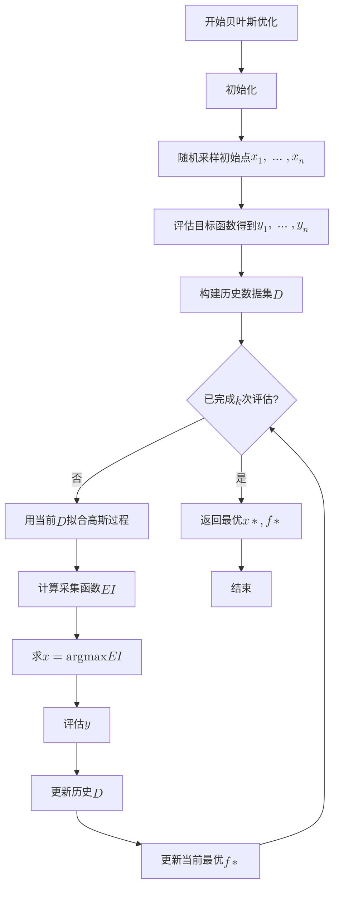

# 基于贝叶斯理论的超参数的优化方法

## 目录

1. [核心思想](#核心思想)
2. [采集函数](#采集函数)
3. [约束优化](#约束优化)
4. [完整算法](#完整算法)

---

## 核心思想

### 用概率模型指导超参数搜索

贝叶斯优化的核心是**用概率模型指导搜索过程**，而不是盲目搜索（网格、随机）。

**理论表述**：
$$\mathbf{x}_{t+1} = \arg\max_{\mathbf{x} \in \mathcal{X}} \alpha_t(\mathbf{x})$$

其中：

- $\mathbf{x}_{t+1}$：下一个要评估的样本点 **（超参数）**
- $\alpha_t(\mathbf{x})$：基于历史数据的采集函数
- $\mathcal{X}$：搜索空间

**代码实现**：

```python
class HyperparameterOptimizer:
    def __init__(self, backtest_func, param_manager, n_calls=50, n_random_starts=10):
        # 理论：定义搜索空间 X
        self.space = [
            Real(*param_manager.param_ranges["CITIC_LIMIT"], name="CITIC_LIMIT"),
            Real(*param_manager.param_ranges["CMVG_LIMIT"], name="CMVG_LIMIT"),
            Real(*param_manager.param_ranges["STK_HOLD_LIMIT"], name="STK_HOLD_LIMIT"),
            Real(*param_manager.param_ranges["OTHER_LIMIT"], name="OTHER_LIMIT"),
            Real(*param_manager.param_ranges["STK_BUY_R"], name="STK_BUY_R"),
            Real(*param_manager.param_ranges["TURN_MAX"], name="TURN_MAX"),
            Real(*param_manager.param_ranges["MEM_HOLD"], name="MEM_HOLD"),
        ]

        # 理论：初始化历史数据 D = {}
        self.best_score = -np.inf
        self.best_params = None
        self.history = []
```

**直观理解**：

- 想象在 7 维参数空间中寻找最优的投资组合配置
- 每次评估（回测）都很昂贵，需要聪明地选择下一个点
- 贝叶斯优化就像一个经验丰富的交易员，根据历史经验判断下一个有潜力的参数组合

### 迭代更新的数学本质

**理论公式**：
$$\mathcal{D}_{t+1} = \mathcal{D}_t \cup \{(\mathbf{x}_{t+1}, y_{t+1})\}$$

其中 $y_{t+1} = f(\mathbf{x}_{t+1}) + \epsilon$ 是观测到的目标函数值 **（信息比率）**。

**代码实现**：

```python
def objective(self, params: list) -> float:
    """这个函数就是 f(x) + ε 的具体实现"""

    # 1. 将数学参数映射到业务参数
    param_dict = {
        "CITIC_LIMIT": params[0],
        "CMVG_LIMIT": params[1],
        "STK_HOLD_LIMIT": params[2],
        "OTHER_LIMIT": params[3],
        "STK_BUY_R": params[4],
        "TURN_MAX": params[5],
        "MEM_HOLD": params[6],
    }

    # 2. 执行昂贵的目标函数评估
    self.param_manager.set_params(param_dict)
    result = self.backtest_func()  # 这里就是 f(x)

    # 3. 提取观测值 y = f(x) + ε
    info = result["info"]
    ir = info.get("信息比率", 0)
    ex_ret = info.get("超额年化收益", 0)
    ex_std = info.get("超额年化波动", 0)

    # 4. 记录历史数据 D_t
    record = {
        "params": param_dict.copy(),
        "ir": ir,
        "ex_ret": ex_ret,
        "ex_std": ex_std,
        "timestamp": datetime.now().isoformat()
    }
    self.history.append(record)  # 实现 D_{t+1} = D_t ∪ {(x_{t+1}, y_{t+1})}
```

**直观理解**：

- 每次调用 `objective` 函数，就是在参数空间中的一个点进行实验
- 回测结果就是观测值，包含了真实的策略性能
- 历史记录就是我们的"经验"，用来指导后续的参数选择

---

## 采集函数

### 期望改进（EI）：平衡探索与利用的数学表达

**理论公式**：
$$\text{EI}(\mathbf{x}) = \mathbb{E}(f(\mathbf{x}) - f^*)^+$$

**解析表达式**：
$$\text{EI}(\mathbf{x}) = (\mu(\mathbf{x}) - f^*)\Phi\left(\frac{\mu(\mathbf{x}) - f^*}{\sigma(\mathbf{x})}\right) + \sigma(\mathbf{x})\phi\left(\frac{\mu(\mathbf{x}) - f^*}{\sigma(\mathbf{x})}\right)$$

**EI 函数的行为分析**：

1. **利用区域**（$\sigma(\mathbf{x})$ 较小，$μ(\mathbf{x}) > f^*$）：

   - 参数看起来很好，不确定性低
   - $\text{EI}(\mathbf{x})$ 主要由第一项贡献：$\text{EI}(\mathbf{x})\approx(\mu(\mathbf{x}) - f^*)\Phi\left(\frac{\mu(\mathbf{x}) - f^*}{\sigma(\mathbf{x})}\right)$

2. **探索区域**（$\sigma(\mathbf{x})$ 较大）：

   - 参数周围数据少，不确定性高
   - $\text{EI}(\mathbf{x})$ 主要由第二项贡献：$\text{EI}(\mathbf{x})\approx\sigma(\mathbf{x})\phi\left(\frac{\mu(\mathbf{x}) - f^*}{\sigma(\mathbf{x})}\right)$

3. **放弃区域**（$\sigma(\mathbf{x})$ 较小，$μ(\mathbf{x}) < f^*$）：
   - 参数看起来很差，且确定性强
   - $\text{EI}(\mathbf{x})$ 接近 $0$

### 采集函数优化：寻找下一个评估点

**理论问题**：
$$\mathbf{x}_{t+1} = \arg\max_{\mathbf{x} \in \mathcal{X}} \text{EI}(\mathbf{x})$$

**实际挑战**：EI 函数本身是非凸的，需要全局优化。

**scikit-optimize 的解决策略**：

```python
# 在我们的项目中，这个过程由 gp_minimize 自动处理：
result = gp_minimize(
    func=wrapped_objective,           # 目标函数 f(x)
    dimensions=self.space,             # 搜索空间 X
    n_calls=self.n_calls,             # 总评估次数
    n_random_starts=self.n_random_starts,  # 随机起始点数量
    random_state=self.random_state,   # 随机种子
)
```

**内部优化过程（简化版）**：

```python
def optimize_acquisition(gp_model, space, n_random_starts=10):
    """优化采集函数找到下一个点"""

    # 1. 随机生成候选点
    candidates = []
    for _ in range(n_random_starts):
        candidate = []
        for dim in space:
            candidate.append(np.random.uniform(dim.low, dim.high))
        candidates.append(candidate)

    # 2. 在每个候选点附近进行局部优化
    best_candidate = None
    best_ei = -np.inf

    for candidate in candidates:
        # 使用梯度下降或其他局部优化器
        local_opt = minimize(lambda x: -expected_improvement(x.reshape(1, -1), gp_model, current_best),
                          candidate,
                          method='L-BFGS-B',
                          bounds=[(dim.low, dim.high) for dim in space])

        if -local_opt.fun > best_ei:
            best_ei = -local_opt.fun
            best_candidate = local_opt.x

    return best_candidate
```

**直观理解**：

- 就像在 7 维参数空间中寻找"最有潜力"的位置
- 既考虑"看起来很好"的位置（利用），也考虑"不确定但可能更好"的位置（探索）
- 通过多次局部搜索避免陷入局部最优

---

## 约束优化

### 约束优化的数学表达

**原始问题**：

$$
\begin{align*}
\max_{\mathbf{x}} \quad & f(\mathbf{x}) = \text{信息比率} \\
\text{s.t.} \quad & g_1(\mathbf{x}) = \text{超额年化收益} \geq \text{基准收益} \\
& g_2(\mathbf{x}) = \text{超额年化波动} \leq \text{基准波动} \\
& \mathbf{x} \in [\mathbf{x}_{\text{min}}, \mathbf{x}_{\text{max}}]
\end{align*}
$$

**转化为无约束问题（惩罚函数法）**：
$$\max_{\mathbf{x}} F(\mathbf{x}) = f(\mathbf{x}) + \lambda_1 g_1(\mathbf{x})^- -\lambda_2 g_2(\mathbf{x})^+$$

### 在代码中的具体实现

```python
def objective(self, params: list) -> float:
    """这就是约束优化的具体实现"""

    # 1. 获取基础目标函数值
    ir = info.get("信息比率", 0)           # f(x): 信息比率
    ex_ret = info.get("超额年化收益", 0)     # g1(x): 超额收益
    ex_std = info.get("超额年化波动", 0)     # g2(x): 超额波动

    # 2. 基础分数（目标函数）
    score = ir

    # 3. 约束处理（惩罚函数）
    if self.best_info is not None:
        base_ex_ret = self.best_info.get("超额年化收益", 0)
        base_ex_std = self.best_info.get("超额年化波动", 0)

        # 约束1: 超额收益不降低
        if ex_ret < base_ex_ret:
            penalty = (base_ex_ret - ex_ret) * self.penalty_weight_ret
            score -= penalty  # λ1 * max(0, g1(x))

        # 约束2: 超额波动不增加
        if ex_std > base_ex_std:
            penalty = (ex_std - base_ex_std) * self.penalty_weight_std
            score -= penalty  # λ2 * max(0, g2(x))

    # 4. 返回负值（因为scikit-optimize是最小化）
    return -score  # 实际上是最小化 -F(x)
```

### 惩罚权重的设计

**数学理论**：
$$\lambda_1, \lambda_2 \gg \max |f(\mathbf{x})|$$

确保约束违反的惩罚足够大。

**实际选择**：

```python
# 在我们的项目中
self.penalty_weight_ret = 1.0e3   # λ1 = 1000
self.penalty_weight_std = 5.0e2    # λ2 = 500

# 为什么选择这些值？
# 信息比率的典型范围：[-2, 2]
# 超额收益的典型范围：[-0.2, 0.2]
# 惩罚权重确保：即使很小的约束违反也会被严重惩罚
```

**直观理解**：

- 这就像投资中的风险控制：宁可错过一些收益，也不能违反风险约束
- 惩罚函数是对"不可接受"参数的硬性拒绝
- 权重的大小反映了我们对不同约束的重视程度

---

## 完整算法


